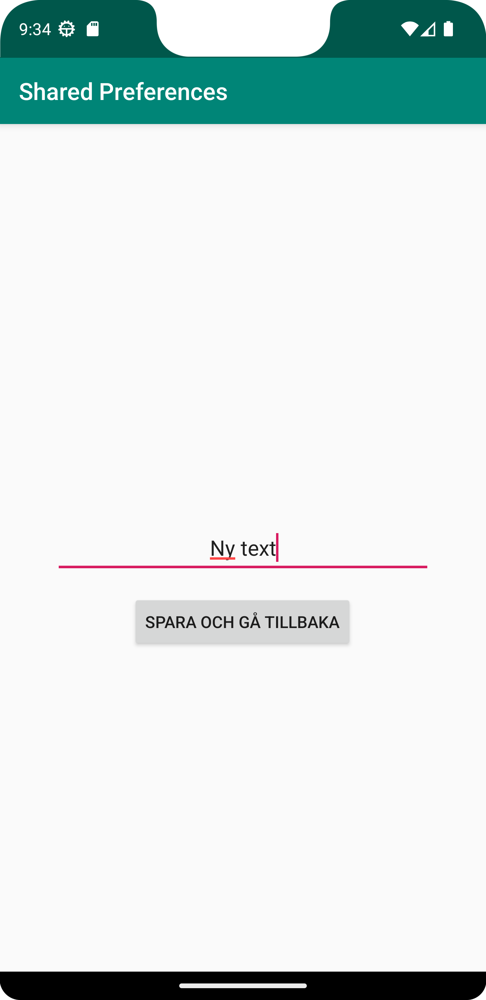

_(Försökte få kodexemplen från canvas att fungera, men lyckades inte.
Har huvudsakligen följt denna länk: https://www.geeksforgeeks.org/shared-preferences-in-android-with-examples/
Med lite annat.)_


Jag började med att skapa en second activity med tillhörande layout fil.
Vidare skapades en knapp i main för att ta sig till second activity, och vice versa.

I second lades en Edittext till, och i main en textview. Planen är att kunna skriva text i editview, och presentera den i textview.

Båda knapparna fick varsin intent för att öppna den andres activity.
Second activity fick dessutom finish(); för att undvika stackande fönster.


Second activity exempel:
```
            @Override
            public void onClick(View v) {
                Intent intent = new Intent(SecondActivity.this, MainActivity.class);
                startActivity(intent);
                finish();
            }
        });
```


I samma onclick som ovan (second activity) lades även nedan till, med kommentarer som beskriver varje steg:
```
                //Get text from Edit and convert to string. Store in "text".
                String text = vSecondEditText.getText().toString();
                
                //retrieve/create instance of SharedPreferences called "sharedPrefs"
                SharedPreferences sharedPref = getSharedPreferences("sharedPrefs", Context.MODE_PRIVATE);
                
                //Retrieve/create editor instance in sharedPref
                SharedPreferences.Editor editor = sharedPref.edit();
                
                //add value of "text" to editor
                editor.putString("stringKey", text);
                
                //apply to save changes to editor
                editor.apply();
```
Först initieras String text som hämtar värdet ur edittext och konverterar till string.
Därefter skapas nu en instans av shared preferenses. Instansen får namnet "sharedPrefs".
Däreter skapas Editor i sharedPrefs. I denna lagras nyckelparet "stringKey" tillsammans med strängen från edittext.
slutligen sparas ändringarna i editorn med hjälp av apply().

Kortfattat innebär detta att när knappen trycks så lagras värdet från edittext i shared preferences.


I main läggs en onResume()-metod till:
```
    @Override
    protected void onResume() {
        super.onResume();

        //retrieve sharedPrefs and store in "mainSharedPrefs"
        SharedPreferences mainSharedPrefs = getSharedPreferences("sharedPrefs", Context.MODE_PRIVATE);
        //retrieve value of stringKey from mainSharedPrefs and store in "displayText"
        String displayText = mainSharedPrefs.getString("stringKey", "");

        //set value of "displayText" in vTextView (R.id.mainTextview) with setText
        vTextView.setText(displayText);
    }
```

Än mer kortfattat; här hämtas värdet ur shared preferences och används för att ändra texten i textview.


**Resultatbilder**

Nystartad app:


Second activity med Edittext:



Main activity igen, nu med ny text:
